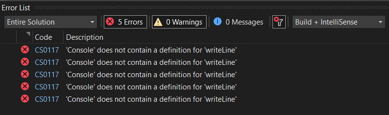
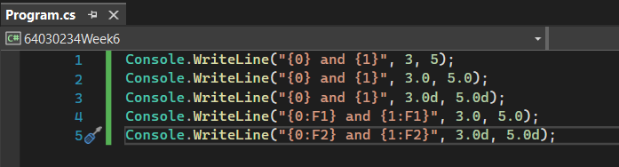
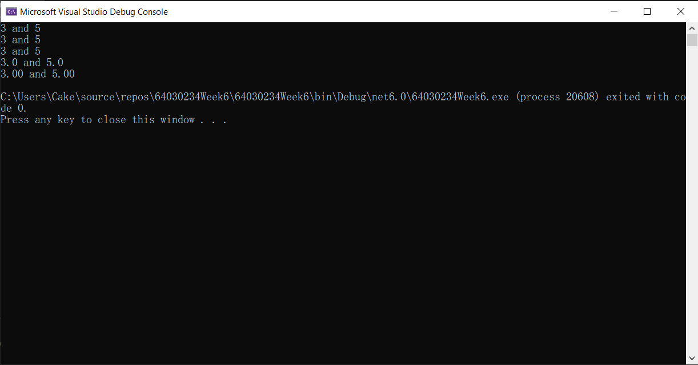
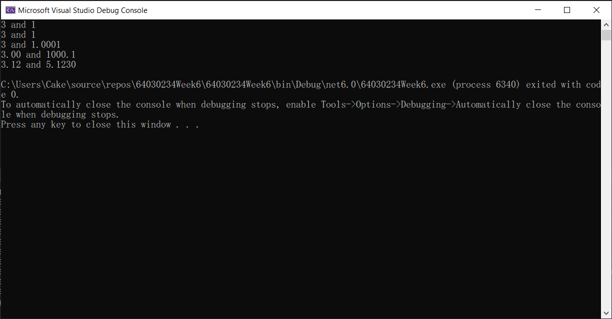
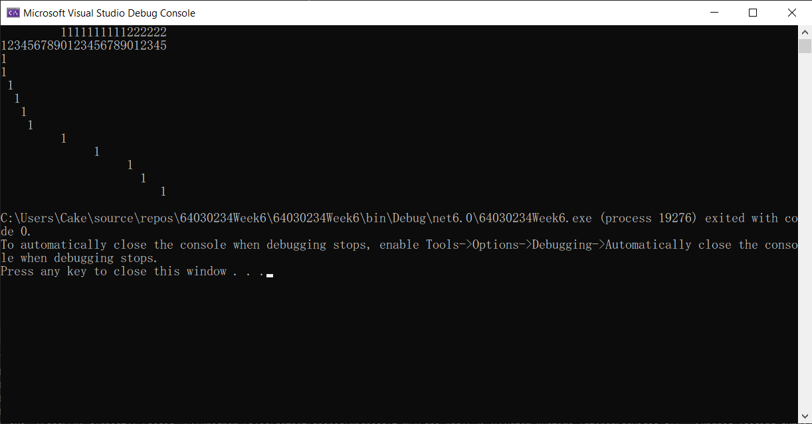
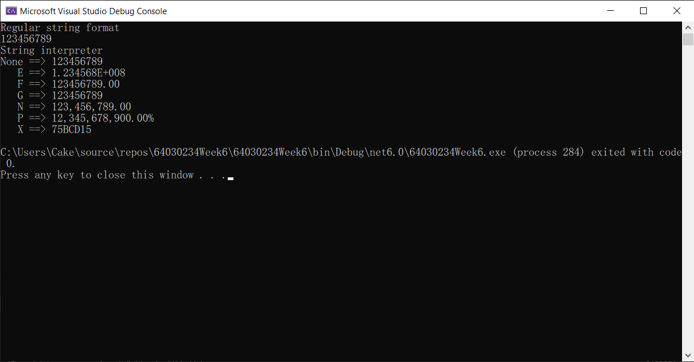

# แบบฝึกหัด

## 1. ให้นักศึกษาพิจารณาชื่อตัวแปรตามตารางต่อไปนี้ ว่าสามารถใช้ได้หรือไม่ พร้อมบอกเหตุผล

|    ที่ |  ชื่อตัวแปร   | ใช้ได้/ไม่ได้ | เหตุผล                                |
| ---: | :--------: | --------- | ------------------------------------ |
|  1.1 |    xxx     | ใช้ได้      | ไม่มีตัวอักษรที่ละเมิดกฎการตั้งชื่อ             |
|  1.2 |    null    | ใช้ไม่ได้    | เป็นคำสงวนในภาษา C#                    |
|  1.3 |   _value   | ใช้ได้      | ไม่มีตัวอักษรที่ละเมิดกฎการตั้งชื่อ             |
|  1.4 | First-name | ใช้ไม่ได้    | ตัวแปรจะต้องไม่ประกอบไปด้วยอักษรพิเศษทุกชนิด |
|  1.5 |   Hello!   | ใช้ไม่ได้    | ตัวแปรจะต้องไม่ประกอบไปด้วยอักษรพิเศษทุกชนิด |
|  1.6 |    w*h     | ใช้ไม่ได้    | ตัวแปรจะต้องไม่ประกอบไปด้วยอักษรพิเศษทุกชนิด |
|  1.7 |    time    | ใช้ได้      | ไม่มีตัวอักษรที่ละเมิดกฎการตั้งชื่อ             |
|  1.8 |     do     | ใช้ไม่ได้    | เป็นคำสงวนในภาษา C#                    |
|  1.9 |     Do     | ใช้ได้      | ไม่มีตัวอักษรที่ละเมิดกฎการตั้งชื่อ             |
| 1.10 | 21November | ใช้ไม่ได้    | ละเมิดกฎการตั้งชื่อ                       |
| 1.11 | ladkrabang | ใช้ได้      | ไม่มีตัวอักษรที่ละเมิดกฎการตั้งชื่อ             |
| 1.12 |   Double   | ใช้ได้      | ไม่มีตัวอักษรที่ละเมิดกฎการตั้งชื่อ             |
| 1.13 |   My Car   | ใช้ไม่ได้    | ละเมิดกฎการตั้งชื่อ                       |
| 1.14 |  my_home   | ใช้ได้      | ไม่มีตัวอักษรที่ละเมิดกฎการตั้งชื่อ             |
| 1.15 |    Int     | ใช้ไม่ได้    | เป็นคำสงวนในภาษา C#                       

## 2.  จงบอกชนิดข้อมูลที่สามารถรองรับค่าต่อไปนี้อย่างเหมาะสมพร้อมทั้งใส่ค่าเริ่มต้นตามที่กำหนดให้ ถ้าข้อใดมีหลายตัวแปร ให้ระบุให้ครบ
 

2.1 (ตัวอย่าง) เสียงเดินทางด้วยความเร็ว 340.0 เมตรต่อวินาที

```csharp
    float speedOfSound = 340.0f;
```

2.2 จำนวนนักศึกษาในชั้นเรียนนี้คือ 42 คน
```csharp
    int numberOfStudents = 42;
```
2.3 ระยะห่างจากดวงอาทิตย์ถึงโลกคือ 149,668,992 กิโลเมตร
```csharp
    long distanceFromSunToEarth = 149668992L;
```
2.4 ชาวนามีวัว 12 ตัว ม้า 68 ตัว และ ไก่ 12,000 ตัว ตามกฎหมาย เมืองนี้อนุญาตให้เลี้ยงสัตว์ที่เท้าได้ไม่เกินครอบครัวละ 200 ตัว (มี 3 ตัวแปร)
```csharp
    int numberOfCows = 12;
    int numberOfHorses = 68;
    int numberOfChickens = 12000;
```
2.5 แดงวัดขนาดของบ้าน พบว่าต้องใช้อิฐจำนวน 1325.8 ชิ้น แต่เมื่อไปถึงร้านก่อสร้าง พบว่าเขาขายอิฐเป็นยก ยกละ 10 ก้อน ไม่ขายเป็นเศษ
```csharp
    float numberOfBricks = 1325.8f;
    int numberOfBricksPerBag = 10;
```

2.6 แสงเดินทางด้วยความเร็ว 299,337.984 กิโลเมตรต่อวินาที  ดาวศุกร์ห่างจากดวงอาทิตย์ 108,200,000 กิโลเมตร อยากทราบว่าแสงใช้เวลาในการเดินทางกี่วินาที (มี 3 ตัวแปร)
```csharp
    float speedOfLight = 299337.984f;
    long distanceFromSunToMars = 108200000L;
    float timeToTravel = 0.0f;
```

# งานฝึกเขียนโปรแกรม

## Project 6.1 การประกาศตัวแปร ## 

1. สร้าง consol project

2. ใน method main ให้ประกาศตัวแปรดังต่อไปนี้

``` text
int var = 30;
Int var1;
int var2, var3;
int var4 = var5;
Int var6 = 2, var7;
int var8 = 10 * 5;
int var9 = var;
int var10, Char c1, Float f1;
double d1 = False;
Bool b1 = 0;
```

3. มีบรรทัดใดบ้าง ที่มีข้อความผิดพลาด 
``` text
บรรทัดที่ 4, 5, 8, 9, 10
```
3.1 compiler ฟ้องว่าอะไร


The build failed. Fix the build errors and run again.
exit status 1
```
3.2 นักศึกษาคิดว่าที่ผิดพลาดนั้นเกิดจากอะไร
``` text
บรรทัดที่ 4: ไม่ได้ประกาศตัวแปร var5 ก่อนนำมาใช้ในการกำหนดค่าให้กับ var4
บรรทัดที่ 5: ไม่ได้ใช้ชื่อตัวแปร Int ในการประกาศตัวแปร var6
บรรทัดที่ 8: ประกาศตัวแปร var10 และ c1 แต่ไม่ได้ระบุประเภทของตัวแปร c1
บรรทัดที่ 9: ไม่สามารถกำหนดค่า False ให้กับตัวแปรประเภท double ได้ เนื่องจาก False เป็นค่าคงที่ประเภท boolean และไม่สามารถแปลงเป็นประเภท double ได้
บรรทัดที่ 10: ไม่สามารถกำหนดค่า 0 ให้กับตัวแปรประเภท bool ได้ เนื่องจาก 0 เป็นค่าคงที่ประเภท int และไม่สามารถแปลงเป็นประเภท bool ได้
```
3.3 จะแก้ไขให้ถูกต้องได้อย่างไร
```csharp
int var = 30;
int var1;
int var2, var3;
int var4 = var5; // ต้องกำหนดค่าให้กับ var5 ก่อนใช้งาน
int var5 = 50; // เพิ่มตัวแปร var5 เพื่อใช้ใน var4
int var6 = 2, var7;
int var8 = 10 * 5;
int var9 = var;
int var10; 
char c1; // ใช้คำว่า char ไม่ใช้ Char และไม่ต้องกำหนดค่าเริ่มต้น
float f1; // ไม่ต้องกำหนดค่าเริ่มต้น
double d1 = 0.0; // ใช้ค่าเริ่มต้น 0.0 แทน False
bool b1 = false; // ใช้คำว่า bool แทน Bool และใช้ค่าเริ่มต้น false แทน 0
```

## Project 6.2 การใช้งานตัวแปรใน string interpreter ## 

String interpreter จะช่วยตีความให้ค่าในตัวแปรชนิดต่างๆ กลายเป็น string โดยอัตโนมัติ ดังตัวอย่าง

 ```cs
int a = 100;
string s = $"a = {a}";
 ```

ตัวแปร `a` ในเครื่องหมาย `{ }` จะถูกแปลงเป็นข้อความ เทียบเท่ากับการใช้ `a.ToString();` 


1. สร้าง consol project
2. ใน method Main() ให้เขียนโปรแกรมต่อไปนี้ (แบ่งเป็นรอบๆ ตามชุดที่กำหนด) รันและบันทึกผล 
3. อธิบายสิ่งที่เกิดขึ้นในแต่ละบรรทัด
#### 4. ถ้ามีที่ผิดใน code ให้แก้ไขให้ถูกต้องจนรันได้และนำส่วนที่แก้ไขแล้วมาใส่ในใบงานด้วย (เขียนในส่วนคำตอบ ไม่ต้องแก้ในส่วนของโจทย์)


#### ชุดที่ 1 ####
```cs
Console.writeLine("{0} and {1}", 3,5);
Console.writeLine("{0} and {1}", 3.0,5.0);
Console.writeLine("{0} and {1}", 3.0d, 5.0d);
Console.writeLine("{0:F1} and {1:F1}", 3.0, 5.0);
Console.writeLine("{0:F2} and {1:F2}", 3.0d, 5.0d);

```
- ผลการรัน


- แก้ไข



- ผลการรัน

- อธิบาย Code 
```text
1.แสดงผลเลข 3 และ 5
2.แสดงผลเลข 3 และ 5 แบบไม่มีทศนิยมเพราะไม่ประกาศว่าตัวเลขเป็นชนิดที่มีทศนิยม
3.แสดงผลเลข 3 และ 5 โดยประกาศเป็นชนิด double
4.แสดงผลเลข 3 และ 5 โดยให้มีทศนิยม 1 ตำแหน่งด้วยคำสั่ง {0:F1} คือ ลำดับที่ 0 ทศนิยม 1 ตำแหน่ง
5.แสดงผลเลข 3 และ 5 โดยให้มีทศนิยม 1 ตำแหน่งด้วยคำสั่ง {0:F2} คือ ลำดับที่ 0 ทศนิยม 2 ตำแหน่ง
```
#### ชุดที่ 2 ####
```cs
Console.WriteLine($"{3} and {1}");
Console.WriteLine($"{3} and {1}");
Console.WriteLine($"{3.0d} and {1.0001d}");
Console.WriteLine($"{3:F2} and {1000.123:F1}");
Console.WriteLine($"{3.123456:F2} and {5.123000:F4}");
```
- ผลการรัน



- อธิบาย Code 
```text
1.แสดงผลเลข 3 และ 1 โดยใช้ เครื่องหมาย $ ไว้หน้าเครื่องหมาย แทนการใช้คำสั่ง Console.Write("{0}",55);
2.เหมือบรรทัดที่ 1 
3.แสดงตัวเลขโดยกำหนดให้เป็นชนิด double
4.แสดงเลขโดยแสดงเลขกำหนดให้แสดงทศนิยม 2 ตำแหน่งที่เลข 3 และ ทศนิยม 1 ตำแหน่งที่เลข 1
5.แสดงเลขโดยแสดงเลขกำหนดให้แสดงทศนิยม 2 ตำแหน่งที่เลข 3 และ ทศนิยม 4 ตำแหน่งที่เลข 5
```

#### ชุดที่ 3 ####
```cs
Console.WriteLine($"         1111111111222222");
Console.WriteLine($"1234567890123456789012345");
Console.WriteLine($"{1,0}");
Console.WriteLine($"{1,1}");
Console.WriteLine($"{1,2}");
Console.WriteLine($"{1,3}");
Console.WriteLine($"{1,4}");
Console.WriteLine($"{1,5}");
Console.WriteLine($"{1,10}");
Console.WriteLine($"{1,15}");
Console.WriteLine($"{1,20}");
Console.WriteLine($"{1,22}");
Console.WriteLine($"{1,25}");
```
- ผลการรัน



- อธิบาย Code 
```text
1.ทำให้ดูว่าสามารถแสดงเลขชิดขวาได้โดยการกด spacebar
2.เป็นตัวหำหนดตำแหน่งที่ 0 - 25
3.แสดงเลข 1 ที่ตำแหน่งที่ 0
4.แสดงเลข 1 ที่ตำแหน่งที่ 1
5.แสดงเลข 1 ที่ตำแหน่งที่ 2
6.แสดงเลข 1 ที่ตำแหน่งที่ 3
7.แสดงเลข 1 ที่ตำแหน่งที่ 4
8.แสดงเลข 1 ที่ตำแหน่งที่ 5
9.แสดงเลข 1 ที่ตำแหน่งที่ 10
10.แสดงเลข 1 ที่ตำแหน่งที่ 15
11.แสดงเลข 1 ที่ตำแหน่งที่ 20
12.แสดงเลข 1 ที่ตำแหน่งที่ 22
13.แสดงเลข 1 ที่ตำแหน่งที่ 25
```
#### ชุดที่ 4 ####
```cs
int i = 123456789;
Console.WriteLine("Regular string format");
Console.WriteLine("{0}",i);
Console.WriteLine("String interpreter");
Console.WriteLine($"None ==> {i}");
Console.WriteLine($"   E ==> {i:E}");
Console.WriteLine($"   F ==> {i:F}");
Console.WriteLine($"   G ==> {i:G}");
Console.WriteLine($"   N ==> {i:N}");
Console.WriteLine($"   P ==> {i:P}");
Console.WriteLine($"   X ==> {i:X}");
```
- ผลการรัน


- อธิบาย Code 
```text
1.กำหนดค่าให้ตัวแปร i
2.แสดงข้อความ regular string format
3.แสดงค่าในตัวแปร i แบบปกติ
4.แสดงข้อความ string interpreter
5.แสดงค่าในตัวแปร i แบบปกติ
6.แสดงค่าในตัวแปร i แบบปยกกำลัง
7.แสดงค่าในตัวแปร i แบบทศนิยม 2 ตำแหน่งเนื่องจากไม่ได้ระบุว่าให้แสดงกี่ตำแหน่ง
8.แสดงค่าในตัวแปร i เลือกแสดงผลในแบบที่เหมาะสมกับค่าที่เลือกที่ระหว่างทศนิยมและยกกำลัง
9.แสดงค่าในตัวแปร i แบบจำนวนเต็มโดยแบ่งหลักด้วย ,
10.แสดงค่าในตัวแปร i แบบเปอร์เซ็น
11.แสดงค่าในตัวแปร i แบบเลขฐาน 16
```

#### ชุดที่ 5 ####
```cs
int i = 123456789;
Console.WriteLin("Regular string format");
Console.WriteLin("         {0,20}",i);
Console.WriteLin("String interpreter");
Console.WriteLin($"None ==> {i,20}");
Console.WriteLin($"   E ==> {i,20:E}");
Console.WriteLin($"   F ==> {i,20:F}");
Console.WriteLin($"   G ==> {i,20:G}");
Console.WriteLin($"   N ==> {i,20:N}");
Console.WriteLin($"   P ==> {i,20:P}");
Console.WriteLin($"   X ==> {i,20:X}");
```
- ผลการรัน



- อธิบาย Code 
```text
1.กำหนดค่าให้ตัวแปร i
2.แสดงข้อความ regular string format
3.แสดงค่าในตัวแปร i แบบปกติโดยให้แสดงผลชิดหวาหรือตำแหน่งที่ 20
4.แสดงข้อความ string interpreter
5.แสดงค่าในตัวแปร i แบบปกติโดยให้แสดงผลชิดหวาหรือตำแหน่งที่ 20
6.แสดงค่าในตัวแปร i แบบปยกกำลังโดยให้แสดงผลชิดหวาหรือตำแหน่งที่ 20
7.แสดงค่าในตัวแปร i แบบทศนิยม 2 ตำแหน่งเนื่องจากไม่ได้ระบุว่าให้แสดงกี่ตำแหน่งโดยให้แสดงผลชิดหวาหรือตำแหน่งที่ 20
8.แสดงค่าในตัวแปร i เลือกแสดงผลในแบบที่เหมาะสมกับค่าที่เลือกที่ระหว่างทศนิยมและยกกำลังโดยให้แสดงผลชิดหวาหรือตำแหน่งที่ 20
9.แสดงค่าในตัวแปร i แบบจำนวนเต็มโดยแบ่งหลักด้วย , โดยให้แสดงผลชิดหวาหรือตำแหน่งที่ 20
10.แสดงค่าในตัวแปร i แบบเปอร์เซ็นโดยให้แสดงผลชิดหวาหรือตำแหน่งที่ 20
11.แสดงค่าในตัวแปร i แบบเลขฐาน 16โดยให้แสดงผลชิดหวาหรือตำแหน่งที่ 20
```
#### ชุดที่ 6 ####
```cs
const double i = 123.456789;
Console.writLine($"{i,10:F1}");
Console.writLine($"{i,10:F2}");
Console.writLine($"{i,10:F3}");
Console.writLine($"{i,10:F4}");
Console.writLine($"{i,10:F5}");
```
- ผลการรัน


- อธิบาย Code 
```text
1.กำหนดค่่าให้ตัวแปร i เป็นชนิด double และเป็นค่าคงที่
2.แสดงค่าในตัวแปร i เป็นทศนิยม 1 ตำแหน่งและชิดขวาในตำแหน่งที่ 10
3.แสดงค่าในตัวแปร i เป็นทศนิยม 2 ตำแหน่งและชิดขวาในตำแหน่งที่ 10
3.แสดงค่าในตัวแปร i เป็นทศนิยม 3 ตำแหน่งและชิดขวาในตำแหน่งที่ 10
4.แสดงค่าในตัวแปร i เป็นทศนิยม 4 ตำแหน่งและชิดขวาในตำแหน่งที่ 10
5.แสดงค่าในตัวแปร i เป็นทศนิยม 5 ตำแหน่งและชิดขวาในตำแหน่งที่ 10
```
#### ชุดที่ 7 ####
```cs
string name = "Hello";
Consol.writeLine(String.Format("{0} there. I said {0}! {0}???", name));
Consol.writeLine($"{2:d} {0:d} {1:d}", 1, 2, 3);
Consol.writeLine($"Hello " + $"World");
Consol.writeLine($"Here comes a slash \\");
Consol.writeLine($"|{999, 10}|");
Consol.writeLine($"|{000,-10}|");
Consol.writeLine($"The value: {500}.");
Consol.writeLine($"The value: {500:C}.");
Consol.writeLine($"{12.3456789,-10:F4}");
Consol.writeLine($"{12.3456789,-10:C}");
Consol.writeLine($"{12.3456789,-10:E3}");
Consol.writeLine($"{65535,-10:x}");
Consol.writeLine($"{65535,-10:X}");
int i;
Console.writeLine("Value\tSquared\tCubed");
for (i = 1; i < 10; i++)
    Console.writeLine($"{i}\t{i*i}\t{i*i*i}");
Console.WriteLine($"{1234.56789:#.###}.");
```
- ผลการรัน


- อธิบาย Code 
```text
1.กำหนดค่าในตัวแปร name = Hello!
2.แสดงข้อความ Hello there. I said Hello!Hello??? โดยใช้ Method String.Format() แทน {} ด้วยข้อความในตัวแปร name
3.แสดงเลข 2 0 1 ไม่ใช่ 3 1 2 เนื่องจากมี $ อยู่หน้า "" ทำให้สามารถใส่ตัวเลขลงไปได้เลยไม่จำเป็นต้อง {0} {1}
4.แสดงข้อความ Hello World
5.แสดงข้อความ Here comes to slash \ เพราะใส่ \\ หากใส่ \ แค่ตัวเดียวจะไม่สามารถแสดง \ ได้ 
6.แสดงเลข 999 ในตำแหน่งที่ 10
7.แสดงเลข 0 ที่ตำแหน่งที่ 0 เนื่องจาก cmd ไท้ทีตำแหน่งที่ -10
8.แสดงข้อความ value 500.
9.แสดงข้อความ value $500.00. เนื่องจาก C ทำให้แสดงเป็นสกุลเงิน
10.แสดงเลขที่กำหนดพร้อมทศนิยม 4 ตำแหน่งใน
11.แสดงเป็นเงินสกุลดอลล่าและทศนิยม 2 ตำแหน่ง
12.แสดงเป็นเลขยกกำลัง
13.แสดงเป็นเลขฐาน 16 แบบพิมพ์เล็ก
14.แสดงเป็นเลขฐาน 16 แบบพิมพ์ใหญ่
15.กำหนดตัวแปร i เป็น int
16.แสดงข้อความ Value   squared   cubed
17.กำหนดเงื่อนไขลูปให้ i = 1 ถ้า ให้ทำไปเรื่อยๆจนกว่า i < 10 ให้ i เพิ่มขึ้นทีละ 1
18.แสดงค่าตัวแรก value = i; squared = i * i;cubed = i * i * i;
19.แสดงผล 1234.568 โดยใช้ #.### กำหนดให้แสดงผลเป็นทศนิยม 3 ตำแหน่ง
```
---- 

## Project 6.3 static keyword ## 
1. สร้าง project ชนิด console
2. เขียนโปรแกรมต่อไปนี้
#### 3. ถ้ามีที่ผิดใน code ให้แก้ไขให้ถูกต้องจนรันได้และนำส่วนที่แก้ไขแล้วมาใส่ในใบงานด้วย (เขียนในส่วนคำตอบ ไม่ต้องแก้ในส่วนของโจทย์)


```cs
using System;
using System.Collections.Generic;
using System.Linq;
using System.Text;
using System.Threading.Tasks;


namespace method_examples
{
    class number
    {
        static public int numberInt1;
        static public double numberDouble1;
        public int numberInt2;
        public double  numberDouble2;
    }
    class Program
    {
        static void Main()
        {
            Number.numberInt1 = 10;
            Number.numberInt2 = 20;
            Number.numberDouble1 = 100.500;
            Number.numberDouble2 = 200.500;

            Console.WriteLine($"NumberInt1 = {number.NumberInt1}");
            Console.WriteLine($"NumberInt2 = {number.NumberInt2}");
            Console.WriteLine($"NumberDouble1 = {number.NumberDouble1}");
            Console.WriteLine($"NumberDouble2 = {number.NumberDouble2}");

        }
    }
}
```

### คำถาม ###

1. ผลการทำงานเป็นอย่างไร

```text
ผลการรันจะเป็น error
```
2. บรรทัดไหนของโปรแกรมที่มี error บ้าง เพราะอะไร
```text
มี error ที่บรรทัดที่ 9, 10, 11 และ 12
เพราะ มีการใช้ชื่อ class ไม่ตรงกัน ในส่วนของการเขียนโค้ด มีการประกาศ class number และใช้ชื่อ Number.numberInt1 และ Number.numberInt2 ซึ่งไม่ตรงกับชื่อ class ที่ประกาศไว้ จึงเกิด error ขึ้น
```
3. ถ้าจะให้โปรแกรมทำงานได้ สามารถแก้ไขอย่างไรได้บ้าง
```text
สามารถแก้ไขโปรแกรมได้โดยการเปลี่ยนชื่อ class ให้ตรงกัน และเปลี่ยนชื่อตัวแปรให้ตรงกับชื่อ class ที่ประกาศไว้
```