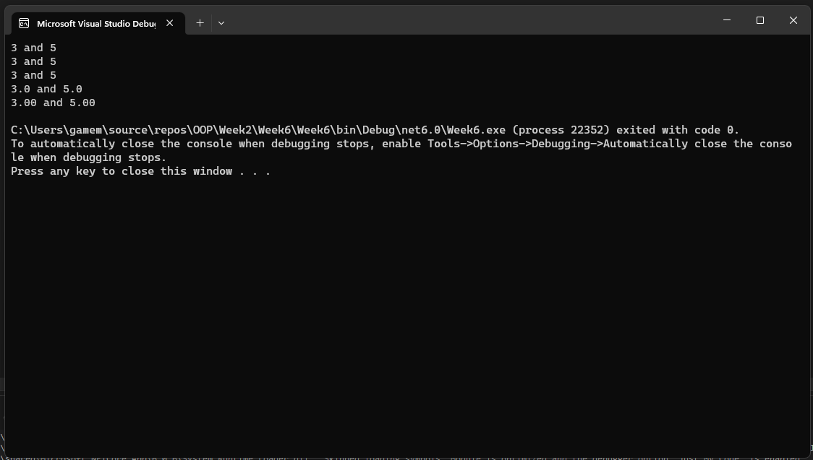
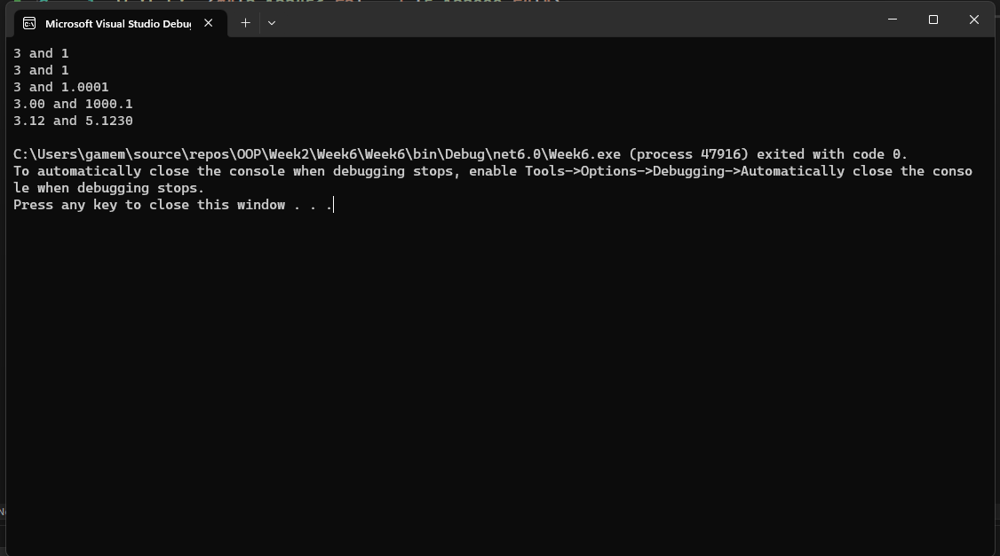
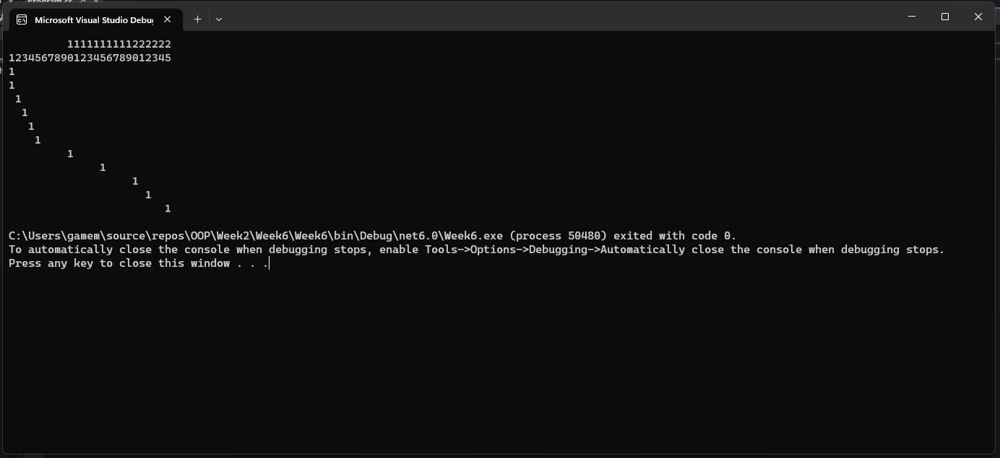
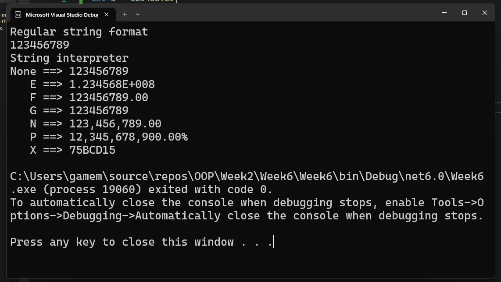
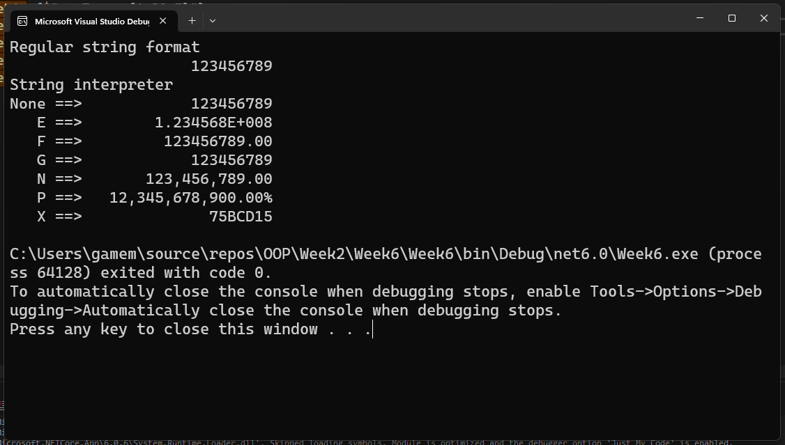
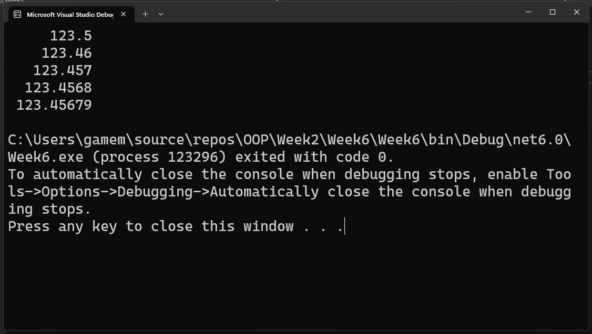
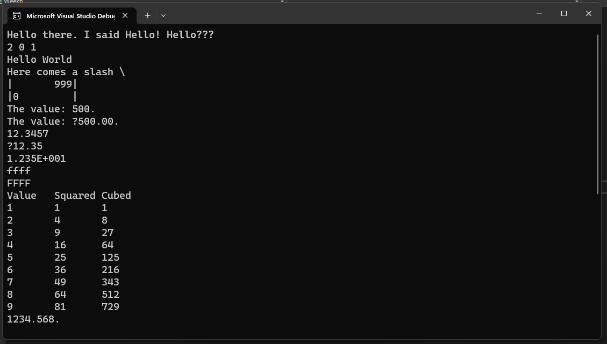

# แบบฝึกหัด

## 1. ให้นักศึกษาพิจารณาชื่อตัวแปรตามตารางต่อไปนี้ ว่าสามารถใช้ได้หรือไม่ พร้อมบอกเหตุผล

| ที่ | ชื่อตัวแปร | ใช้ได้/ไม่ได้ | เหตุผล |
|---:|:-------:|-----------|-------|
|  1.1 | xxx         | ใช้ได้  | ไม่มีตัวอักษรที่ละเมิดกฎการตั้งชื่อ
|  1.2 | null        | ใช้ไม่ได้ | เป็นคำสงวนในภาษา C#
|  1.3 | _value      |  ใช้ได้ | 
|  1.4 | First-name  | ใช้ไม่ได้      |   ผิดไวยากรณ์
|  1.5 | Hello!      |  ใช้ไม่ได้      |  ผิดไวยากรณ์
|  1.6 | w * h       | ใช้ไม่ได้       |  ผิดไวยากรณ์       
|  1.7 | time        | ใช้ได้       |        
|  1.8 | do          | ใช้ไม่ได้       |  เป็นคำสงวนในภาษา C#      
|  1.9 | Do          | ใช้ได้       |        
| 1.10 |  14February | ใช้ไม่ได้       | การตั้งชื่อตัวแปรจะต้องไม่ใช้ตัวเลขขึ้นต้น       
| 1.11 |  1adkrabang |  ใช้ไม่ได้      |  การตั้งชื่อตัวแปรจะต้องไม่ใช้ตัวเลขขึ้นต้น       
| 1.12 | Double      |  ใช้ได้      |        
| 1.13 | My Car      | ใช้ไม่ได้       |  การตั้งชื่อตัวแปรต้องไม่เว้นวรรค      
| 1.14 | my_home     |   ใช้ได้     |        
| 1.15 | Int         |  ใช้ได้      |    

## 2.  จงบอกชนิดข้อมูลที่สามารถรองรับค่าต่อไปนี้อย่างเหมาะสมพร้อมทั้งใส่ค่าเริ่มต้นตามที่กำหนดให้ ถ้าข้อใดมีหลายตัวแปร ให้ระบุให้ครบ
 

2.1 (ตัวอย่าง) เสียงเดินทางด้วยความเร็ว 340.0 เมตรต่อวินาที

```csharp
    float speedOfSound = 340.0f;
```

2.2 จำนวนนักศึกษาในชั้นเรียนนี้คือ 42 คน
```csharp
    int student = 42;
```
2.3 ระยะห่างจากดวงอาทิตย์ถึงโลกคือ 149,668,992 กิโลเมตร
```csharp
    long EarthDistanceSun = 149668992;
```
2.4 ชาวนามีวัว 12 ตัว ม้า 68 ตัว และ ไก่ 12,000 ตัว ตามกฎหมาย เมืองนี้อนุญาตให้เลี้ยงสัตว์ที่เท้าได้ไม่เกินครอบครัวละ 200 ตัว (มี 3 ตัวแปร)
```csharp
    sbyte cow = 12;
    sbyte horse = 68;
    ushort chicken = 12000;
```
2.5 แดงวัดขนาดของบ้าน พบว่าต้องใช้อิฐจำนวน 1325.8 ชิ้น แต่เมื่อไปถึงร้านก่อสร้าง พบว่าเขาขายอิฐเป็นยก ยกละ 10 ก้อน ไม่ขายเป็นเศษ
```csharp
    float brick = 1325.8f;
    int sell_brick = 10;
```

2.6 แสงเดินทางด้วยความเร็ว 299,337.984 กิโลเมตรต่อวินาที  ดาวศุกร์ห่างจากดวงอาทิตย์ 108,200,000 กิโลเมตร อยากทราบว่าแสงใช้เวลาในการเดินทางกี่วินาที (มี 3 ตัวแปร)
```csharp
    double lightspeed = 299337.984f;
    double VenusDistanceEarth = 108200000;
    double time = VenusDistanceEarth/lightspeed;
```

# งานฝึกเขียนโปรแกรม

## Project 6.1 การประกาศตัวแปร ## 

1. สร้าง consol project

2. ใน method main ให้ประกาศตัวแปรดังต่อไปนี้

``` text
int var = 30;
Int var1;
int var2, var3;
int var4 = var5;
Int var6 = 2, var7;
int var8 = 10 * 5;
int var9 = var;
int var10, Char c1, Float f1;
double d1 = False;
Bool b1 = 0;
```

3. มีบรรทัดใดบ้าง ที่มีข้อความผิดพลาด 
``` text
บรรทัดที่ 2 
บรรทัดที่ 4
บรรทัดที่ 5
บรรทัดที่ 8
บรรทัดที่ 9
บรรทัดที่ 10
```
3.1 compiler ฟ้องว่าอะไร
``` text
CS1044 Cannot use more than one type in a for, using,fixed,or declaration statement 
CS1003 Syntax error,',' expected
CS0246 The type or namespace name 'Int' could not be found (are you missing directive or an assembly reference?)
CS0103 The name 'var5' dose not exist in the current context
CS0103 The name 'False' dose not exist in the current context
CS0246 The type or namespace name 'Bool' could not be found (are you missing directive or an assembly reference?)
```
3.2 นักศึกษาคิดว่าที่ผิดพลาดนั้นเกิดจากอะไร
``` text
บรรทัดที่ 2 ประเภทข้อมูลผิด
บรรทัดที่ 4 ไม่มีตัวแปร var5
บรรทัดที่ 5 ประเภทข้อมูลผิด
บรรทัดที่ 8 ประกาศประเภทข้อมูลไม่เหมือนกันในประเภทเดียวกัน
บรรทัดที่ 9 ประกาศประเภทข้อมูลผิด 
บรรทัดที่ 10 ประกาศประเภทตัวแปรผิด
```
3.3 จะแก้ไขให้ถูกต้องได้อย่างไร
``` text
บรรทัดที่ 2 int var;
บรรทัดที่ 4 int var5;
int var4 = var5;
บรรทัดที่ 5 int var6 = 2, var7;
บรรทัดที่ 8 int var10;
char c1;
float f1;
บรรทัดที่ 9 bool d1 = false;
บรรทัดที่ 10 bool b1 = 0;
```
## Project 6.2 การใช้งานตัวแปรใน string interpreter ## 

String interpreter จะช่วยตีความให้ค่าในตัวแปรชนิดต่างๆ กลายเป็น string โดยอัตโนมัติ ดังตัวอย่าง

 ```cs
int a = 100;
string s = $"a = {a}";
 ```

ตัวแปร `a` ในเครื่องหมาย `{ }` จะถูกแปลงเป็นข้อความ เทียบเท่ากับการใช้ `a.ToString();` 


1. สร้าง consol project
2. ใน method Main() ให้เขียนโปรแกรมต่อไปนี้ (แบ่งเป็นรอบๆ ตามชุดที่กำหนด) รันและบันทึกผล 
3. อธิบายสิ่งที่เกิดขึ้นในแต่ละบรรทัด
#### 4. ถ้ามีที่ผิดใน code ให้แก้ไขให้ถูกต้องจนรันได้และนำส่วนที่แก้ไขแล้วมาใส่ในใบงานด้วย (เขียนในส่วนคำตอบ ไม่ต้องแก้ในส่วนของโจทย์)


#### ชุดที่ 1 ####
```cs
Console.writeLine("{0} and {1}", 3,5);
Console.writeLine("{0} and {1}", 3.0,5.0);
Console.writeLine("{0} and {1}", 3.0d, 5.0d);
Console.writeLine("{0:F1} and {1:F1}", 3.0, 5.0);
Console.writeLine("{0:F2} and {1:F2}", 3.0d, 5.0d);
```
#### ผลลัพธ์ ชุดที่1 ####
```cs
Console.WriteLine("{0} and {1}", 3, 5); //แสดงผลลัพธ์ 3 และ 5 
Console.WriteLine("{0} and {1}", 3.0, 5.0); //แสดงผลลัพธ์ 3 และ 5 ไม่แสดงทศนิยม 
Console.WriteLine("{0} and {1}", 3.0d, 5.0d); //กำหนด 3.0 และ 5.0 เป็น Decimal
Console.WriteLine("{0:F1} and {1:F1}", 3.0, 5.0); //แสดงผลลัพธ์ 3.0 และ 5.0 แต่เป็นทศนิยม 1 ตำแหน่ง
Console.WriteLine("{0:F2} and {1:F2}", 3.0d, 5.0d); //แสดงผลลัพธ์ 3.0 และ 5.0 แต่เป็นทศนิยม 2 ตำแหน่ง
```

#### ชุดที่ 2 ####
```cs
Console.WriteLine($"{3} and {1}");
Console.WriteLine($"{3} and {1}");
Console.WriteLine($"{3.0d} and {1.0001d}");
Console.WriteLine($"{3:F2} and {1000.123:F1}");
Console.WriteLine($"{3.123456:F2} and {5.123000:F4}");
```
#### ผลลัพธ์ ชุดที่ 2 ####

```cs
Console.WriteLine($"{3} and {1}"); //แสดงผล 3 และ 1 โดยไม่ได้กำหนดลำดับช้อมูล
Console.WriteLine($"{3} and {1}"); //แสดงผล 3 และ 1 โดยไม่ได้กำหนดลำดับช้อมูล
Console.WriteLine($"{3.0d} and {1.0001d}"); //กำหนด 3.0d และ 1.0001d เป็น Decimal
Console.WriteLine($"{3:F2} and {1000.123:F1}"); //กำหนดให้ 3 แสดงทศนิยม 2 ตำแหน่ง กำหนดให้ 1000.123 แสดงทศนิยม 1 ตำแหน่ง
Console.WriteLine($"{3.123456:F2} and {5.123000:F4}"); //กำหนดให้ 3.123456 แสดงทศนิยม 2 ตำแหน่ง กำหนดให้ 5.123000 แสดงทศนิย 4 ตำแหน่ง
```
#### ชุดที่ 3 ####
```cs
Console.WriteLine($"         1111111111222222");
Console.WriteLine($"1234567890123456789012345");
Console.WriteLine($"{1,0}");
Console.WriteLine($"{1,1}");
Console.WriteLine($"{1,2}");
Console.WriteLine($"{1,3}");
Console.WriteLine($"{1,4}");
Console.WriteLine($"{1,5}");
Console.WriteLine($"{1,10}");
Console.WriteLine($"{1,15}");
Console.WriteLine($"{1,20}");
Console.WriteLine($"{1,22}");
Console.WriteLine($"{1,25}");
```
### ผลลัพธ์ ชุดที่ 3 ####

```cs
Console.WriteLine($"         1111111111222222"); //ตัวอย่างในสามารถทำให้ตัวเลขชิดขวาโดยการกด Spacebar
Console.WriteLine($"1234567890123456789012345"); //กำหนดตำแหน่งโดยใช้ 1234567890123456789012345 แทนตำแหน่งโดยตำแหน่งแรกเริมจาก 0 จากตัวอย่างมีตำแหน่งทั้ง 25 ตำแหน่ง
Console.WriteLine($"{1,0}"); //แสดงตัวเลข 1 ตำแหน่งที่ 0
Console.WriteLine($"{1,1}"); //แสดงตัวเลข 1 ตำแหน่งที่ 1
Console.WriteLine($"{1,2}"); //แสดงตัวเลข 1 ตำแหน่งที่ 2
Console.WriteLine($"{1,3}"); //แสดงตัวเลข 1 ตำแหน่งที่ 3
Console.WriteLine($"{1,4}"); //แสดงตัวเลข 1 ตำแหน่งที่ 4
Console.WriteLine($"{1,5}"); //แสดงตัวเลข 1 ตำแหน่งที่ 5
Console.WriteLine($"{1,10}"); //แสดงตัวเลข 1 ตำแหน่งที่ 10
Console.WriteLine($"{1,15}"); //แสดงตัวเลข 1 ตำแหน่งที่ 15
Console.WriteLine($"{1,20}"); //แสดงตัวเลข 1 ตำแหน่งที่ 20
Console.WriteLine($"{1,22}"); //แสดงตัวเลข 1 ตำแหน่งที่ 22
Console.WriteLine($"{1,25}"); //แสดงตัวเลข 1 ตำแหน่งที่ 25
```
#### ชุดที่ 4 ####
```cs
int i = 123456789;
Console.WriteLine("Regular string format");
Console.WriteLine("{0}",i);
Console.WriteLine("String interpreter");
Console.WriteLine($"None ==> {i}");
Console.WriteLine($"   E ==> {i:E}");
Console.WriteLine($"   F ==> {i:F}");
Console.WriteLine($"   G ==> {i:G}");
Console.WriteLine($"   N ==> {i:N}");
Console.WriteLine($"   P ==> {i:P}");
Console.WriteLine($"   X ==> {i:X}");
```
#### ผลลัพธ์ ชุดที่ 4 ####

```cs
int i = 123456789; //กำหนดตัวแปร i มีค่า 123456789
Console.WriteLine("Regular string format"); //แสดงข้อความ Regular string format
Console.WriteLine("{0}",i);//แสดงผล ข้อมูลตัวแปร i
Console.WriteLine("String interpreter"); //แสดงข้อความ String interpreter
Console.WriteLine($"None ==> {i}"); //แสดงข้อความในตัวแปร i
Console.WriteLine($"   E ==> {i:E}"); //กำหนด i แสดงผลเป็นเลขยกกำลัง
Console.WriteLine($"   F ==> {i:F}"); //กำหนดให้ i แสดงผลทศนิยมถ้าไม่กำหนดจะแสดงเป็น 2 ทศนิยม
Console.WriteLine($"   G ==> {i:G}"); //กำหนดให้ i แสดงผลในแบบที่เหมาะสมระหว่างค่าทศนิยมหรือยกกำลัง
Console.WriteLine($"   N ==> {i:N}"); //กำหนดให้ i ปรับ format เป็นตัวเลขแบ่งตามหลัก
Console.WriteLine($"   P ==> {i:P}"); //กำหนดให้ i แสดงผลเป็นเปอร์เซ็น
Console.WriteLine($"   X ==> {i:X}"); //กำหนดให้ i แสดงผลเป็นเลขฐาน 16 
```
#### ชุดที่ 5 ####
```cs
int i = 123456789;
Console.WriteLin("Regular string format");
Console.WriteLin("         {0,20}",i);
Console.WriteLin("String interpreter");
Console.WriteLin($"None ==> {i,20}");
Console.WriteLin($"   E ==> {i,20:E}");
Console.WriteLin($"   F ==> {i,20:F}");
Console.WriteLin($"   G ==> {i,20:G}");
Console.WriteLin($"   N ==> {i,20:N}");
Console.WriteLin($"   P ==> {i,20:P}");
Console.WriteLin($"   X ==> {i,20:X}");
```
#### ผลลัพธ์ ชุดที่ 5 ####

```cs
int i = 123456789; //กำหนดตัวแปร i มีค่า 123456789
Console.WriteLin("Regular string format"); //แสดงข้อความ Regular string format
Console.WriteLin("         {0,20}",i); //กำหนดของข้อความไว้ที่ตำแหน่งที่20 และแสดงค่าตัวแปร i 
Console.WriteLin("String interpreter"); //แสดงข้อความ String interpreter
Console.WriteLin($"None ==> {i,20}"); //กำหนดของข้อความไว้ที่ตำแหน่งที่20 และแสดงค่าตัวแปร i 
Console.WriteLin($"   E ==> {i,20:E}"); //กำหนดของข้อความไว้ที่ตำแหน่งที่20 และแสดงค่าตัวแปร i เป็นเลขยกกำลัง
Console.WriteLin($"   F ==> {i,20:F}"); //กำหนดของข้อความไว้ที่ตำแหน่งที่20 และแสดงค่าตัวแปร i เป็นทศนิยมถ้าไม่กำหนดจะแสดงเป็น 2 ทศนิยม
Console.WriteLin($"   G ==> {i,20:G}"); //กำหนดของข้อความไว้ที่ตำแหน่งที่20 และแสดงค่าตัวแปร i เลือกความเหมาะสมในการแสดงระหว่างค่าทศนิยมหรือยกกำลัง
Console.WriteLin($"   N ==> {i,20:N}"); //กำหนดของข้อความไว้ที่ตำแหน่งที่20 และแสดงค่าตัวแปร i  โดยเป็น Format ตัวเลขแบ่งตามหลัก
Console.WriteLin($"   P ==> {i,20:P}"); //กำหนดของข้อความไว้ที่ตำแหน่งที่20 และแสดงค่าตัวแปร i  เป็นเปอร์เซ็น
Console.WriteLin($"   X ==> {i,20:X}"); //กำหนดของข้อความไว้ที่ตำแหน่งที่20 และแสดงค่าตัวแปร i เป็นเลขฐาน 16
```

#### ชุดที่ 6 ####
```cs
const double i = 123.456789;
Console.writLine($"{i,10:F1}");
Console.writLine($"{i,10:F2}");
Console.writLine($"{i,10:F3}");
Console.writLine($"{i,10:F4}");
Console.writLine($"{i,10:F5}");
```
#### ผลลัพธ์ชุดที่ 6 ####

```cs
const double i = 123.456789; //กำหนดค่าตัวแปร i เป็น 123.456789
Console.writLine($"{i,10:F1}"); //แสดงผลค่าตัวแปร i ตำแหน่งที่ 10 แสดงทศนิยม 1 ตำแหน่ง 
Console.writLine($"{i,10:F2}"); //แสดงผลค่าตัวแปร i ตำแหน่งที่ 10 แสดงทศนิยม 2 ตำแหน่ง 
Console.writLine($"{i,10:F3}"); //แสดงผลค่าตัวแปร i ตำแหน่งที่ 10 แสดงทศนิยม 3 ตำแหน่ง 
Console.writLine($"{i,10:F4}"); //แสดงผลค่าตัวแปร i ตำแหน่งที่ 10 แสดงทศนิยม 4 ตำแหน่ง 
Console.writLine($"{i,10:F5}"); //แสดงผลค่าตัวแปร i ตำแหน่งที่ 10 แสดงทศนิยม 5 ตำแหน่ง 
```
#### ชุดที่ 6 ####
```cs
string name = "Hello"; 
Consol.writeLine(String.Format("{0} there. I said {0}! {0}???", name));
Consol.writeLine($"{2:d} {0:d} {1:d}", 1, 2, 3);
Consol.writeLine($"Hello " + $"World");
Consol.writeLine($"Here comes a slash \\");
Consol.writeLine($"|{999, 10}|");
Consol.writeLine($"|{000,-10}|");
Consol.writeLine($"The value: {500}.");
Consol.writeLine($"The value: {500:C}.");
Consol.writeLine($"{12.3456789,-10:F4}");
Consol.writeLine($"{12.3456789,-10:C}");
Consol.writeLine($"{12.3456789,-10:E3}");
Consol.writeLine($"{65535,-10:x}");
Consol.writeLine($"{65535,-10:X}");
int i;
Console.writeLine("Value\tSquared\tCubed");
for (i = 1; i < 10; i++)
    Console.writeLine($"{i}\t{i*i}\t{i*i*i}");
Console.WriteLine($"{1234.56789:#.###}.");
```
#### ผลลัพธ์ชุดที่ 6 ####

```cs
string name = "Hello"; //กำหนดตัวแปร name เก็บค่า Hello
Consol.writeLine(String.Format("{0} there. I said {0}! {0}???", name)); //แสดงผล {0} there. I said {0}! {0}??? โดย {0} จะแสดงค่าในตัวแปร name
Consol.writeLine($"{2:d} {0:d} {1:d}", 1, 2, 3); //แสดงข้อความโดยกำหนดผลที่แสดงผลเป็นตัวเลขจำนวนเต็ม   
Consol.writeLine($"Hello " + $"World"); //แสดงข้อความ Hello รวมกับ World โดยจะได้ผลลัพธ์ดังภาพ
Consol.writeLine($"Here comes a slash \\"); //แสดงข้อความ Here comes a slash \
Consol.writeLine($"|{999, 10}|"); //แสดงตัวเลข 999 ตำแหน่งที่ 10
Consol.writeLine($"|{000,-10}|"); //แสดงตัวเลข 0 ตำแหน่งที่ -10
Consol.writeLine($"The value: {500}."); //แสดงผล The value: {500}.
Consol.writeLine($"The value: {500:C}."); //แสดงผล โดยกำหนด 500 ในรูปแบบสกุลเงิน
Consol.writeLine($"{12.3456789,-10:F4}"); //แสดงผล ในตำแหน่งที-10 โดยให้แสดงทศนิยม 4 หลัก
Consol.writeLine($"{12.3456789,-10:C}"); //แสดงผล ในตำแหน่งที-10 โดยให้แสดงในรูปแบบสกุลเงิน
Consol.writeLine($"{12.3456789,-10:E3}"); //แสดงผล ในตำแหน่งที-10 โดยให้แสดงยกกำลัง 3
Consol.writeLine($"{65535,-10:x}"); //แสดงผล ในตำแหน่งที-10 โดยแสดงในรูปเลขฐาน 16 แต่เป็นตัวอักษรตัวเล็ก
Consol.writeLine($"{65535,-10:X}"); //แสดงผล ในตำแหน่งที-10 โดยแสดงในรูปเลขฐาน 16 แต่เป็นตัวอักษรตัวใหญ่
int i; //กำหนด i เป็น integer
Console.writeLine("Value\tSquared\tCubed"); //กำรูปแบบหัวข้อตาราง
for (i = 1; i < 10; i++) //ทำซ้ำทั้งหมด 10 ครั้ง โดยกำหนดค่าเริ้่มต้นเป็น 1 โดยเมื่อทำเสร็จ 1 รอบจะเพิ่มค่า i หนึ่ง 
    Console.writeLine($"{i}\t{i*i}\t{i*i*i}"); //แสดงผล i โดยช่อง Squared โดยจะเอา i คูณ i ช่อง Cubed จะเอา i คูณ i คูณ i 
Console.WriteLine($"{1234.56789:#.###}."); //แสดงผล 1234.568 โดยใช้ #.### กำหนดให้แสดงผลเป็นทศนิยม 3 ตำแหน่ง 
```
---- 

## Project 6.3 static keyword ## 
1. สร้าง project ชนิด console
2. เขียนโปรแกรมต่อไปนี้
#### 3. ถ้ามีที่ผิดใน code ให้แก้ไขให้ถูกต้องจนรันได้และนำส่วนที่แก้ไขแล้วมาใส่ในใบงานด้วย (เขียนในส่วนคำตอบ ไม่ต้องแก้ในส่วนของโจทย์)


```cs
using System;
using System.Collections.Generic;
using System.Linq;
using System.Text;
using System.Threading.Tasks;


namespace method_examples
{
    class number
    {
        static public int numberInt1;
        static public double numberDouble1;
        public int numberInt2;
        public double  numberDouble2;
    }
    class Program
    {
        static void Main()
        {
            Number.numberInt1 = 10;
            Number.numberInt2 = 20;
            Number.numberDouble1 = 100.500;
            Number.numberDouble2 = 200.500;

            Console.WriteLine($"NumberInt1 = {number.NumberInt1}");
            Console.WriteLine($"NumberInt2 = {number.NumberInt2}");
            Console.WriteLine($"NumberDouble1 = {number.NumberDouble1}");
            Console.WriteLine($"NumberDouble2 = {number.NumberDouble2}");

        }
    }
}
```

### คำถาม ###

1. ผลการทำงานเป็นอย่างไร
```
ผลการรันเป็น Error
```
2. บรรทัดไหนของโปรแกรมที่มี error บ้าง เพราะอะไร
```
มี error ที่บรรทัดที่ 9,10,11 และ 12
เพราะ มีการใช้ชื่อ class ไม่ตรงกัน ในส่วนของการเขียนโค้ด มีการประกาศ class number และใช้ชื่อ Number.numberInt1 และ Number.numberInt2 ซึ่งไม่ตรงกับชื่อ class ที่ประกาศไว้ จึงเกิด error ขึ้น
```
3. ถ้าจะให้โปรแกรมทำงานได้ สามารถแก้ไขอย่างไรได้บ้าง
```
สามารถแก้ไขโปรแกรมได้โดยการเปลี่ยนชื่อ class ให้ตรงกัน และเปลี่ยนชื่อตัวแปรให้ตรงกับชื่อ class ที่ประกาศไว้
```