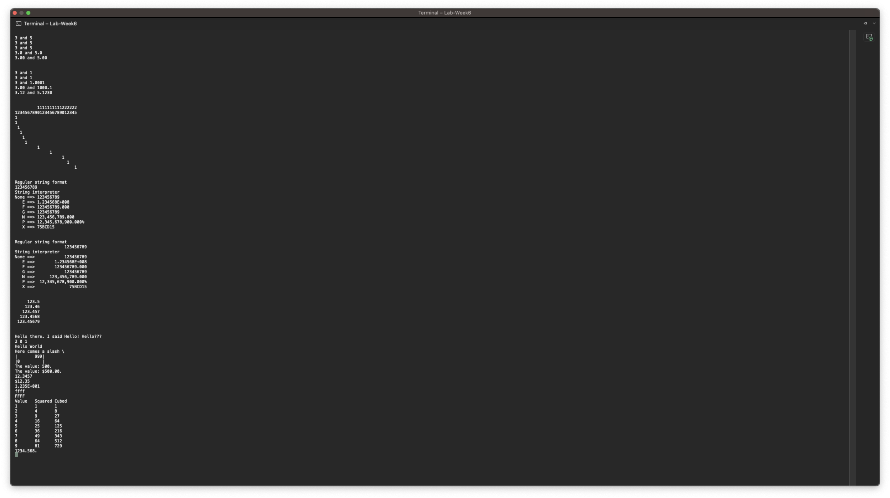
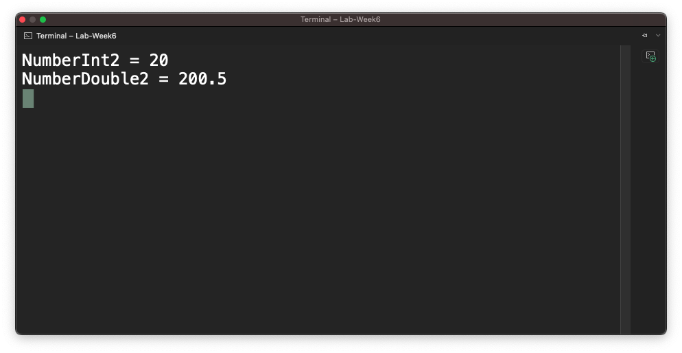

# แบบฝึกหัด

## 1. ให้นักศึกษาพิจารณาชื่อตัวแปรตามตารางต่อไปนี้ ว่าสามารถใช้ได้หรือไม่ พร้อมบอกเหตุผล

|  ที่ | ชื่อตัวแปร | ใช้ได้/ไม่ได้ | เหตุผล                                                             |
| ---: | :--------: | ------------- | ------------------------------------------------------------------ |
|  1.1 |    xxx     | ใช้ได้        | ไม่มีตัวอักษรที่ละเมิดกฎการตั้งชื่อ                                |
|  1.2 |    null    | ใช้ไม่ได้     | เป็นคำสงวนในภาษา C#                                                |
|  1.3 |  \_value   | ใช้้ได้       | ไม่มีตัวอักษรที่ละเมิดกฎการตั้งชื่อ                                |
|  1.4 | First-name | ใช้ไม่ได้     | มีอักขระพิเศษ                                                      |
|  1.5 |   Hello!   | ใช้ไม่ได้     | มีอักขระพิเศษ                                                      |
|  1.6 |   w \* h   | ใช้ไม่ได้     | มีเครื่องหมายที่เป็นคำสั่งให้โปรแกรมทำการคำนวณ                     |
|  1.7 |    time    | ใช้ได้        | ไม่มีตัวอักษรที่ละเมิดกฎการตั้งชื่อ                                |
|  1.8 |     do     | ใช้ไม่ได้     | เป็นคำสงวนในภาษา C#                                                |
|  1.9 |     Do     | ใช้ได้        | ไม่มีตัวอักษรที่ละเมิดกฎการตั้งชื่อ                                |
| 1.10 | 14February | ใช้ไม่ได้     | ตัวแปรต้องเป็นตัวเลขหรือตัวอักษรเท่านั้นและต้องขึ้นต้นด้วยตัวอักษร |
| 1.11 | 1adkrabang | ใช้ไม่ได้     | ตัวแปรต้องเป็นตัวเลขหรือตัวอักษรเท่านั้นและต้องขึ้นต้นด้วยตัวอักษร |
| 1.12 |   Double   |   ใช้ได้            | ไม่มีตัวอักษรที่ละเมิดกฎการตั้งชื่อ 
| 1.13 |   My Car   |    ใช้ไม่ได้           | ตัวแปรไม่สามารถตั้งชื่อที่มีช่องว่างหรืออักขระพิเศษได้
| 1.14 |  my_home   |   ใช้ได้            | ไม่มีตัวอักษรที่ละเมิดกฎการตั้งชื่อ 
| 1.15 |    Int     |   ใช้ได้            |  ไม่มีตัวอักษรที่ละเมิดกฎการตั้งชื่อ 

## 2. จงบอกชนิดข้อมูลที่สามารถรองรับค่าต่อไปนี้อย่างเหมาะสมพร้อมทั้งใส่ค่าเริ่มต้นตามที่กำหนดให้ ถ้าข้อใดมีหลายตัวแปร ให้ระบุให้ครบ

2.1 (ตัวอย่าง) เสียงเดินทางด้วยความเร็ว 340.0 เมตรต่อวินาที

```csharp
    float speedOfSound = 340.0f;
```

2.2 จำนวนนักศึกษาในชั้นเรียนนี้คือ 42 คน
``` csharp
    int student = 42;
```

2.3 ระยะห่างจากดวงอาทิตย์ถึงโลกคือ 149,668,992 กิโลเมตร
``` csharp
    long distance = 149668992;
```

2.4 ชาวนามีวัว 12 ตัว ม้า 68 ตัว และ ไก่ 12,000 ตัว ตามกฎหมาย เมืองนี้อนุญาตให้เลี้ยงสัตว์ที่เท้าได้ไม่เกินครอบครัวละ 200 ตัว (มี 3 ตัวแปร)
``` csharp
    int cow = 12;
    int horse = 68;
    int chiken =12000;
```

2.5 แดงวัดขนาดของบ้าน พบว่าต้องใช้อิฐจำนวน 1325.8 ชิ้น แต่เมื่อไปถึงร้านก่อสร้าง พบว่าเขาขายอิฐเป็นยก ยกละ 10 ก้อน ไม่ขายเป็นเศษ
``` csharp
    float brick = 1325.8;
    int sell_brick = 10;
```
2.6 แสงเดินทางด้วยความเร็ว 299,337.984 กิโลเมตรต่อวินาที ดาวศุกร์ห่างจากดวงอาทิตย์ 108,200,000 กิโลเมตร อยากทราบว่าแสงใช้เวลาในการเดินทางกี่วินาที (มี 3 ตัวแปร)
``` csharp
    double speed_light = 299337.984;
    double distance_venus = 108200000;
    double time = distance_venus / speed_light; 
```
# งานฝึกเขียนโปรแกรม

## Project 6.1 การประกาศตัวแปร

1. สร้าง consol project

2. ใน method main ให้ประกาศตัวแปรดังต่อไปนี้

```text
int var = 30;
Int var1;
int var2, var3;
int var4 = var5;
Int var6 = 2, var7;
int var8 = 10 * 5;
int var9 = var;
int var10, Char c1, Float f1;
double d1 = False;
Bool b1 = 0;
```

3. มีบรรทัดใดบ้าง ที่มีข้อความผิดพลาด <br>
- บรรทัดที่ 2 Int ต้องเป็น int
- บรรทัดที่ 4 int var4 = var5; ไม่มีตัวแปร var5
- บรรทัดที่ 5 Int var6 = 2, var7; ต้องเป็น int var6 = 2, var7;
- บรรทัดที่ 8 int var10, Char c1, Float f1; ต้องเป็น int var10, char c1, float f1;
- บรรทัดที่ 9 double d1 = False; ต้องเป็น bool d1 = false;
- บรรทัดที่ 10 Bool b1 = 0; ต้องเป็น bool b1 = false; <br>
3.1 compiler ฟ้องว่าอะไร
- error CS1044: Cannot use more than one type in a for, using, fixed, or declaration statement
- error CS1003: Syntax error, ',' expected
- error CS1044: Cannot use more than one type in a for, using, fixed, or declaration statement
- error CS1003: Syntax error, ',' expected <br>
3.2 นักศึกษาคิดว่าที่ผิดพลาดนั้นเกิดจากอะไร
- เกิดจากการกำหนดชื่อชนิดตัวแปรผิด และการประกาศใช้ตัวแปรผิด กำหนดค่าให้ตัวแปรผิด <br>
3.3 จะแก้ไขให้ถูกต้องได้อย่างไร
```csharp
int var = 30;
int var1;
int var2, var3;
int var5 = 0;
int var4 = var5;
int var6 = 2, var7;
int var8 = 10 * 5;
int var9 = var;
int var10;
char c1;
float f1;
double d1 = 0;
bool b1 = false;
```
## Project 6.2 การใช้งานตัวแปรใน string interpreter

String interpreter จะช่วยตีความให้ค่าในตัวแปรชนิดต่างๆ กลายเป็น string โดยอัตโนมัติ ดังตัวอย่าง

```cs
int a = 100;
string s = $"a = {a}";
```

ตัวแปร `a` ในเครื่องหมาย `{ }` จะถูกแปลงเป็นข้อความ เทียบเท่ากับการใช้ `a.ToString();`

1. สร้าง consol project
2. ใน method Main() ให้เขียนโปรแกรมต่อไปนี้ (แบ่งเป็นรอบๆ ตามชุดที่กำหนด) รันและบันทึกผล
3. อธิบายสิ่งที่เกิดขึ้นในแต่ละบรรทัด

#### 4. ถ้ามีที่ผิดใน code ให้แก้ไขให้ถูกต้องจนรันได้และนำส่วนที่แก้ไขแล้วมาใส่ในใบงานด้วย (เขียนในส่วนคำตอบ ไม่ต้องแก้ในส่วนของโจทย์)

#### ชุดที่ 1

```cs
Console.writeLine("{0} and {1}", 3,5);
Console.writeLine("{0} and {1}", 3.0,5.0);
Console.writeLine("{0} and {1}", 3.0d, 5.0d);
Console.writeLine("{0:F1} and {1:F1}", 3.0, 5.0);
Console.writeLine("{0:F2} and {1:F2}", 3.0d, 5.0d);
```

#### ชุดที่ 2

```cs
Console.WriteLine($"{3} and {1}");
Console.WriteLine($"{3} and {1}");
Console.WriteLine($"{3.0d} and {1.0001d}");
Console.WriteLine($"{3:F2} and {1000.123:F1}");
Console.WriteLine($"{3.123456:F2} and {5.123000:F4}");
```

#### ชุดที่ 3

```cs
Console.WriteLine($"         1111111111222222");
Console.WriteLine($"1234567890123456789012345");
Console.WriteLine($"{1,0}");
Console.WriteLine($"{1,1}");
Console.WriteLine($"{1,2}");
Console.WriteLine($"{1,3}");
Console.WriteLine($"{1,4}");
Console.WriteLine($"{1,5}");
Console.WriteLine($"{1,10}");
Console.WriteLine($"{1,15}");
Console.WriteLine($"{1,20}");
Console.WriteLine($"{1,22}");
Console.WriteLine($"{1,25}");
```

#### ชุดที่ 4

```cs
int i = 123456789;
Console.WriteLine("Regular string format");
Console.WriteLine("{0}",i);
Console.WriteLine("String interpreter");
Console.WriteLine($"None ==> {i}");
Console.WriteLine($"   E ==> {i:E}");
Console.WriteLine($"   F ==> {i:F}");
Console.WriteLine($"   G ==> {i:G}");
Console.WriteLine($"   N ==> {i:N}");
Console.WriteLine($"   P ==> {i:P}");
Console.WriteLine($"   X ==> {i:X}");
```

#### ชุดที่ 5

```cs
int i = 123456789;
Console.WriteLin("Regular string format");
Console.WriteLin("         {0,20}",i);
Console.WriteLin("String interpreter");
Console.WriteLin($"None ==> {i,20}");
Console.WriteLin($"   E ==> {i,20:E}");
Console.WriteLin($"   F ==> {i,20:F}");
Console.WriteLin($"   G ==> {i,20:G}");
Console.WriteLin($"   N ==> {i,20:N}");
Console.WriteLin($"   P ==> {i,20:P}");
Console.WriteLin($"   X ==> {i,20:X}");
```

#### ชุดที่ 6

```cs
const double i = 123.456789;
Console.writLine($"{i,10:F1}");
Console.writLine($"{i,10:F2}");
Console.writLine($"{i,10:F3}");
Console.writLine($"{i,10:F4}");
Console.writLine($"{i,10:F5}");
```

#### ชุดที่ 7

```cs
string name = "Hello";
Consol.writeLine(String.Format("{0} there. I said {0}! {0}???", name));
Consol.writeLine($"{2:d} {0:d} {1:d}", 1, 2, 3);
Consol.writeLine($"Hello " + $"World");
Consol.writeLine($"Here comes a slash \\");
Consol.writeLine($"|{999, 10}|");
Consol.writeLine($"|{000,-10}|");
Consol.writeLine($"The value: {500}.");
Consol.writeLine($"The value: {500:C}.");
Consol.writeLine($"{12.3456789,-10:F4}");
Consol.writeLine($"{12.3456789,-10:C}");
Consol.writeLine($"{12.3456789,-10:E3}");
Consol.writeLine($"{65535,-10:x}");
Consol.writeLine($"{65535,-10:X}");
int i;
Console.writeLine("Value\tSquared\tCubed");
for (i = 1; i < 10; i++)
    Console.writeLine($"{i}\t{i*i}\t{i*i*i}");
Console.WriteLine($"{1234.56789:#.###}.");
```
สิ่งที่เกิดขึ้น โปรแกรม <br>
 <br>
Code ที่แก้ไขแล้ว
```csharp
using System;

// ชุด 1 //
Console.WriteLine("{0} and {1}", 3, 5);
Console.WriteLine("{0} and {1}", 3.0, 5.0);
Console.WriteLine("{0} and {1}", 3.0d, 5.0d);
Console.WriteLine("{0:F1} and {1:F1}", 3.0, 5.0);
Console.WriteLine("{0:F2} and {1:F2}", 3.0d, 5.0d);
Console.WriteLine('\n');
// ชุด 2 //
Console.WriteLine($"{3} and {1}");
Console.WriteLine($"{3} and {1}");
Console.WriteLine($"{3.0d} and {1.0001d}");
Console.WriteLine($"{3:F2} and {1000.123:F1}");
Console.WriteLine($"{3.123456:F2} and {5.123000:F4}");
Console.WriteLine('\n');

// ชุด 3 //
Console.WriteLine($"         1111111111222222");
Console.WriteLine($"1234567890123456789012345");
Console.WriteLine($"{1,0}");
Console.WriteLine($"{1,1}");
Console.WriteLine($"{1,2}");
Console.WriteLine($"{1,3}");
Console.WriteLine($"{1,4}");
Console.WriteLine($"{1,5}");
Console.WriteLine($"{1,10}");
Console.WriteLine($"{1,15}");
Console.WriteLine($"{1,20}");
Console.WriteLine($"{1,22}");
Console.WriteLine($"{1,25}");
Console.WriteLine('\n');

// ชุด 4 //
int i = 123456789;
Console.WriteLine("Regular string format");
Console.WriteLine("{0}", i);
Console.WriteLine("String interpreter");
Console.WriteLine($"None ==> {i}");
Console.WriteLine($"   E ==> {i:E}");
Console.WriteLine($"   F ==> {i:F}");
Console.WriteLine($"   G ==> {i:G}");
Console.WriteLine($"   N ==> {i:N}");
Console.WriteLine($"   P ==> {i:P}");
Console.WriteLine($"   X ==> {i:X}");
Console.WriteLine('\n');

// ชุด 5 //
int a = 123456789;
Console.WriteLine("Regular string format");
Console.WriteLine("         {0,20}", a);
Console.WriteLine("String interpreter");
Console.WriteLine($"None ==> {a,20}");
Console.WriteLine($"   E ==> {a,20:E}");
Console.WriteLine($"   F ==> {a,20:F}");
Console.WriteLine($"   G ==> {a,20:G}");
Console.WriteLine($"   N ==> {a,20:N}");
Console.WriteLine($"   P ==> {a,20:P}");
Console.WriteLine($"   X ==> {a,20:X}");
Console.WriteLine('\n');

// ชุด 6 //
const double b = 123.456789;
Console.WriteLine($"{b,10:F1}");
Console.WriteLine($"{b,10:F2}");
Console.WriteLine($"{b,10:F3}");
Console.WriteLine($"{b,10:F4}");
Console.WriteLine($"{b,10:F5}");
Console.WriteLine('\n');

// ชุด 7 //
string name = "Hello";
Console.WriteLine(String.Format("{0} there. I said {0}! {0}???", name));
Console.WriteLine($"{2:d} {0:d} {1:d}", 1, 2, 3);
Console.WriteLine($"Hello " + $"World");
Console.WriteLine($"Here comes a slash \\");
Console.WriteLine($"|{999,10}|");
Console.WriteLine($"|{000,-10}|");
Console.WriteLine($"The value: {500}.");
Console.WriteLine($"The value: {500:C}.");
Console.WriteLine($"{12.3456789,-10:F4}");
Console.WriteLine($"{12.3456789,-10:C}");
Console.WriteLine($"{12.3456789,-10:E3}");
Console.WriteLine($"{65535,-10:x}");
Console.WriteLine($"{65535,-10:X}");
int c;
Console.WriteLine("Value\tSquared\tCubed");
for (c = 1; c < 10; c++)
    Console.WriteLine($"{c}\t{c * c}\t{c * c * c}");
Console.WriteLine($"{1234.56789:#.###}.");
```
---

## Project 6.3 static keyword

1. สร้าง project ชนิด console
2. เขียนโปรแกรมต่อไปนี้

#### 3. ถ้ามีที่ผิดใน code ให้แก้ไขให้ถูกต้องจนรันได้และนำส่วนที่แก้ไขแล้วมาใส่ในใบงานด้วย (เขียนในส่วนคำตอบ ไม่ต้องแก้ในส่วนของโจทย์)

```cs
using System;
using System.Collections.Generic;
using System.Linq;
using System.Text;
using System.Threading.Tasks;


namespace method_examples
{
    class number
    {
        static public int numberInt1;
        static public double numberDouble1;
        public int numberInt2;
        public double  numberDouble2;
    }
    class Program
    {
        static void Main()
        {
            Number.numberInt1 = 10;
            Number.numberInt2 = 20;
            Number.numberDouble1 = 100.500;
            Number.numberDouble2 = 200.500;

            Console.WriteLine($"NumberInt1 = {number.NumberInt1}");
            Console.WriteLine($"NumberInt2 = {number.NumberInt2}");
            Console.WriteLine($"NumberDouble1 = {number.NumberDouble1}");
            Console.WriteLine($"NumberDouble2 = {number.NumberDouble2}");

        }
    }
}
```

### คำถาม

1. ผลการทำงานเป็นอย่างไร <br>

 
2. บรรทัดไหนของโปรแกรมที่มี error บ้าง เพราะอะไร <br>
โปรแกรมมี error 2 แห่ง คือ

- บรรทัดที่ 9-12: เนื่องจากจะใช้ class ชื่อ Number ในการกำหนดค่าให้กับตัวแปรต่างๆ แต่ในการเข้าถึงตัวแปรใน class จะต้องใช้ชื่อ class นั้นด้วย ดังนั้นควรแก้เป็น number.numberInt1, number.numberInt2, number.numberDouble1, number.numberDouble2

- บรรทัดที่ 15: เนื่องจาก number เป็น class ธรรมดา ไม่ใช่ class ที่เป็น static ดังนั้นไม่สามารถเข้าถึงตัวแปร numberInt2 ได้โดยตรงจาก class ได้ แต่จะต้องสร้าง instance ของ class number ก่อน ดังนั้นควรแก้เป็น number myNumber = new number(); และใช้ myNumber.numberInt2 ในการเข้าถึงตัวแปรนี้

3. ถ้าจะให้โปรแกรมทำงานได้ สามารถแก้ไขอย่างไรได้บ้าง
```csharp
using System;

namespace Lab_Week6
{
    class Number
    {
        public int numberInt2;
        public double numberDouble2;
    }

    class Program
    {
        static void Main()
        {
            Number number = new Number();
            number.numberInt2 = 20;
            number.numberDouble2 = 200.500;

            Console.WriteLine($"NumberInt2 = {number.numberInt2}");
            Console.WriteLine($"NumberDouble2 = {number.numberDouble2}");
        }
    }
}
```